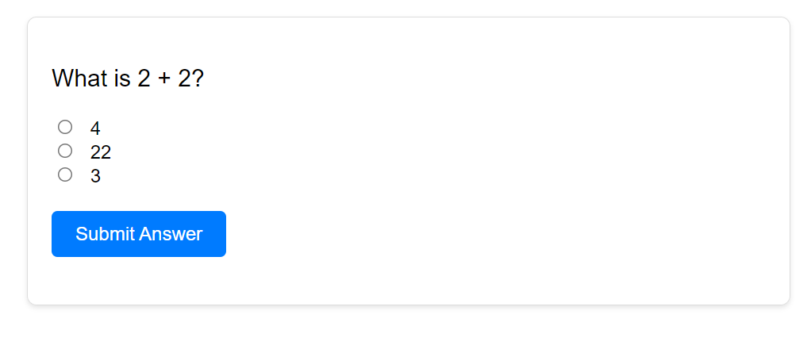

# ALX JavaScript Quiz Project

A simple quiz application built with **HTML, CSS, and JavaScript** as part of my **ALX Software Engineering training**.  
It uses radio buttons for multiple-choice answers, checks the selected option, and shows feedback.

---

## 📌 Features

- Multiple-choice quiz with radio buttons
- Validates answer on submit
- Feedback messages:
  - ✅ Correct → “Correct! Well done.”
  - ❌ Incorrect → “That's incorrect. Try again!”

---

## 🛠️ Built With

- HTML5
- CSS3
- JavaScript

---

## 🌍 Demo

👉 [Live Demo Link Here](https://kateykwesi.github.io/ALX_Simple_Quiz/)

---

## 📸 Screenshots

---

## 📖

This project is part of **ALX JavaScript foundations task** to practice forms, DOM manipulation, and validation.
